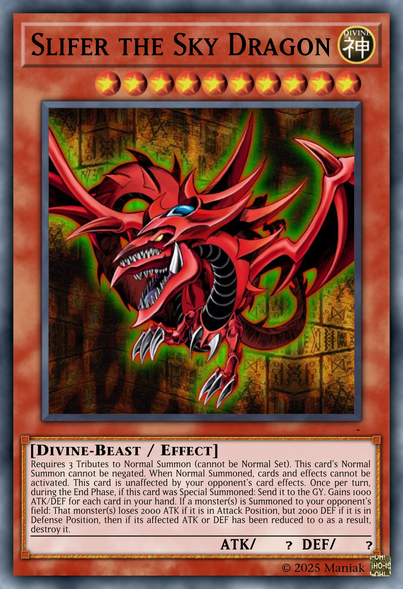

# EDOPro Custom Cards

Custom cards that I've created for [EDOPro](edopro). These cards are not official and are not intended to be used in official tournaments.

Those cards were created and are managed using [YGOFabrica](ygofabrica).

## Installation

* Install and configure YGOFabrica: https://github.com/piface314/ygo-fabrica/wiki/Install
* Clone the repository
* Run the following commands to generate the cards:

```sh
ygofab make
ygofab sync
```

## Card list

* :white_check_mark: -> Fully scripted
* :large_orange_diamond: -> Partially scripted
* :x: -> Not scripted

| Obelisk the Tormentor | The Winged Dragon of Ra | Slifer the Sky Dragon |
|-----------------------|-------------------------|-----------------------|
| :white_check_mark: | :large_orange_diamond: | :white_check_mark: |
|  |  |  |

## Credits

* [Edoardo Lolletti](edo9300): Creator of [EDOPro](edopro)
* [Henrique Santana](piface314): Creator of [YGOFabrica](ygofabrica)
* [YGOProDeck](ygoprodeck): Used to get some card artworks
* [Yu-Gi-Oh! CardMaker](ygocardmaker): Used to create the card pictures

[edopro]: https://github.com/edo9300/edopro
[edo9300]: https://github.com/edo9300
[piface314]: https://github.com/piface314
[ygofabrica]: https://github.com/piface314/ygo-fabrica
[ygoprodeck]: https://ygoprodeck.com/
[ygocardmaker]: https://www.cardmaker.net/yugioh/
